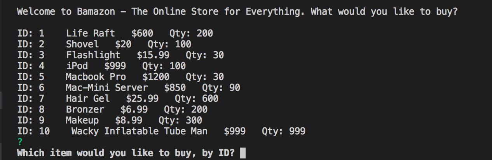
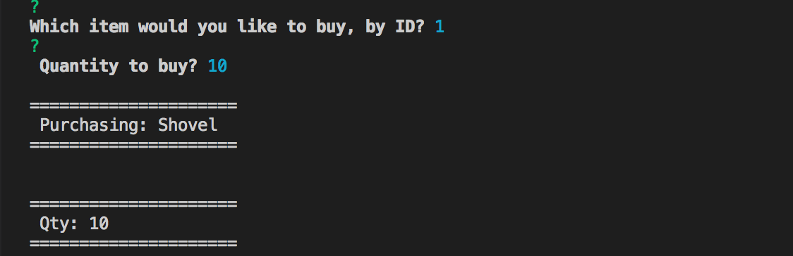

# bamazon-CLI-App
App that takes in orders from customers and deplete stock from the store's inventory.
This is a CLI App focusing on node, mysql and express.

As it is a CLI App, it has to be run from the command line. Additional functionality will be added in the future for managerial capability. 

The Customer can only buy products by ID and quantity. Any attempt at putting something invalid will cause a re-prompt.
Attempting to enter a quantity over what is possible will result in an "Insufficient quanitity message. 

